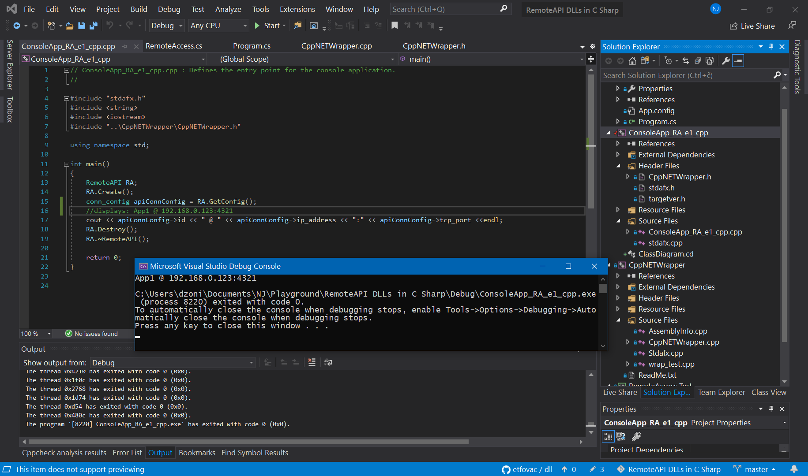

# Wrapped the .NET assembly (LabVIEW classes) into C++ DLL  
[](https://github.com/etfovac/dll/blob/master/LICENSE.md) [](https://zenodo.org/badge/latestdoi/285043029) [](https://github.com/etfovac/dll/releases)

### C# Console  
``` cs
CA1 CA1_ref = FormatterServices.GetUninitializedObject(typeof(CA1)) as CA1;
//CA1 CA1_ref = new CA1(); // 'new' triggers browsing to class file on disk
CBase CB_ref = CA1_ref;
CA1.Create(CA1_ref, out CA1_ref); 
``` 
### C++ Wrapper
CppNETWrapper.h - exports entire class and typedefs  
``` c++
struct rmt_api {
	void* curr_instance;
	std::string last_error;
};
typedef rmt_api* rmt_b;

struct connection_config {
	string id;
	string ip_address;
	unsigned short tcp_port;
};
typedef connection_config* conn_config;

class DllExport RemoteAPI {
private:
	rmt_b rmt;
public:
	RemoteAPI(void);
	virtual ~RemoteAPI(void);
	void Create();
	void  Destroy();
	conn_config GetConfig();
};
```  
CppNETWrapper.cpp - getting the reference
``` c++
RemoteAPI::RemoteAPI(void){	 
// constructor that creates a pointer to .net class and stores it in wrapper class

//ClientApp1::ClientApp1Lib::ClientApp1 ^remote = gcnew  ClientApp1::ClientApp1Lib::ClientApp1();  
// gnew triggers the search to LabVIEW class on disk, so it cannot be used
ClientApp1::ClientApp1Lib::ClientApp1 ^remote0; // empty/null ref  

//remote = (System::Runtime::Serialization::FormatterServices::GetUninitializedObject(remote0->GetType())); 	
// returns null  
//IntPtr hptr = (IntPtr)System::Runtime::Serialization::FormatterServices::GetUninitializedObject(remote->GetType()); 	
// returns null  
  
remote0->GetRef(remote0); 
// works only with GetRef, a custom function added to the LabVIEW class and exported to assembly  
// to provide an actual, uninitialized obj ref  
IntPtr hptr = (IntPtr)GCHandle::Alloc(remote0, GCHandleType::Normal); // class obj to handle, handle to pointer.
this->rmt = new rmt_api;
this->rmt->curr_instance = hptr.ToPointer();
};  
```
### C++ Wrapper Console Output
```c++
#include "stdafx.h"
#include <string>
#include <iostream>
#include "..\CppNETWrapper\CppNETWrapper.h"
using namespace std;

int main(){
RemoteAPI RA;
RA.Create();
conn_config apiConnConfig = RA.GetConfig(); 
//displays: App1 @ 192.168.0.123:4321
cout << apiConnConfig->id << " @ " << apiConnConfig->ip_address << ":" << apiConnConfig->tcp_port <<endl;
 RA.Destroy();
RA.~RemoteAPI();
return 0;
}
```
  

Note: For more on the constructor node issue in VS see <a href="https://github.com/etfovac/dll/issues/2#issue-673036198">'new' triggers browsing to lvclass file on disk</a>

### References  
<a href=https://zone.ni.com/reference/en-XX/help/371361M-01/lvhowto/charac_net_interop/>Characteristics of LabVIEW-Built .NET Interop Assemblies</a>
